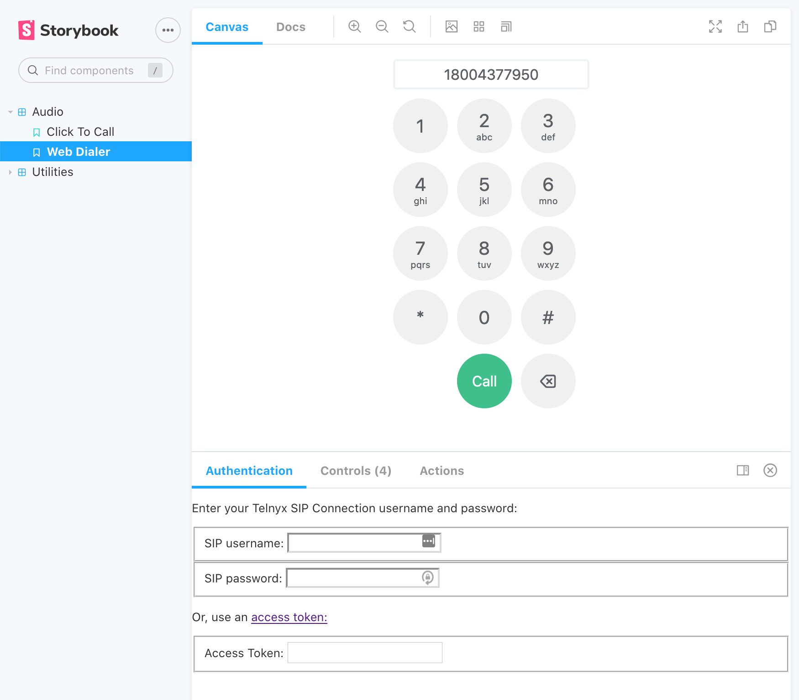

# React Audio Widgets

Sample click-to-call and dialpad drop-in widgets.



## Running the example

Set up and install:

```
npm run setup
npm install
```

To start the Storybook app:

```
npm run storybook
```

Your preferred browser should automatically open up to <http://localhost:6006>.

## Authentication

To login with the Storybook app, enter in your Telnyx WebRTC authentication credentials in the "Authentication" panel. Use the "Controls" panel to configure your destination number, caller number and other per-component options.

This example assumes your client will be set up with an authentication mechanism. For a more comprehensive client example, including how to log your user in, check out the [React video app example](../react-video-calling-app).
