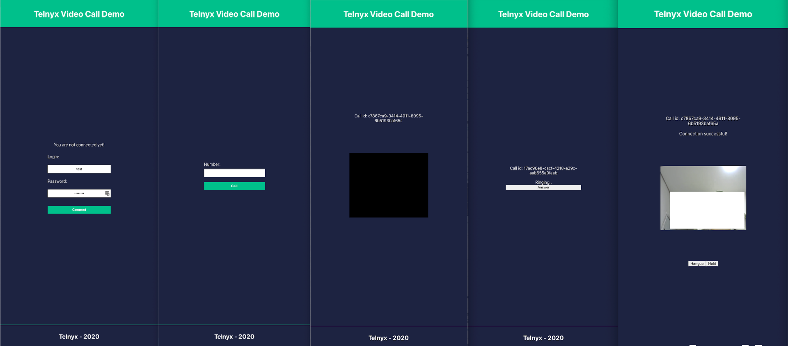

# React Video Calling App

Sample client application that demonstrates:

1. Logging a user in with a SIP Connection username and password
2. Enabling one-on-one video calling



## Running the example

Set up and install:

```
npm run setup
npm install
```

To start the sample app:

```
npm start
```

Your preferred browser should automatically open up to <http://localhost:3000>.
