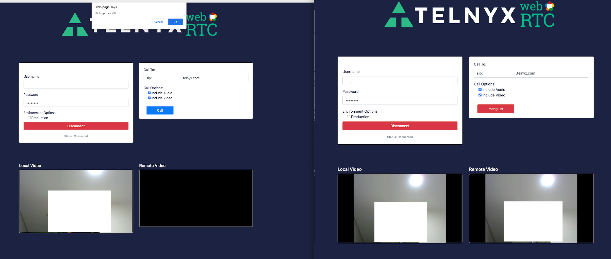

# Vanilla JS App

Sample client application that demonstrates:

1. Logging a user in with a SIP Connection username and password
2. Enabling one-on-one audio & video calling

Screenshot:


## Running the example

Open `index.html` in your browser.

```sh
open index.html
```
